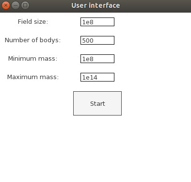

# Simulation of teh n-bodys problem using the barnse-hut-algorithm

## Requirements:
+ SFML: https://www.sfml-dev.org/tutorials/2.5/
+ JSON: libjsoncpp
+ TGUI: https://tgui.eu/tutorials/0.8/

## Inner six planets of the solar system
To load the simulation of the inner six planets out of the provided json-file start the program as follows:   
```./barnes_hut centralized central_sun ```
## User interface

+ Field size: The high and with of the displayed area in meter
+ Number of bodys: The number of bodys to generate
+ Minimum mass: The minimum mass a body can have in kg
+ Maximum mass: The maximum mass a body can have in kg  
The Masses of the bodys are equally distributed between the maximum and the minimum mass
